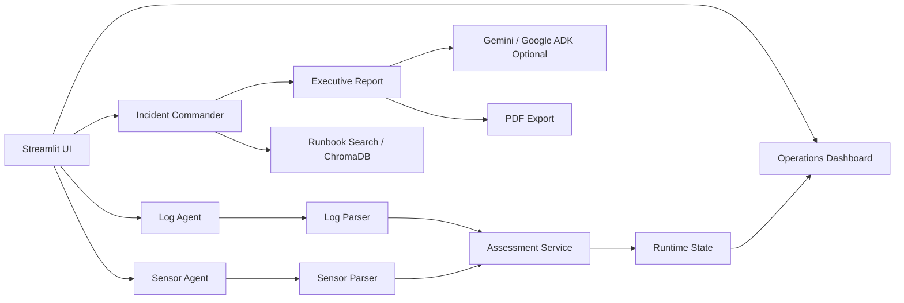

# RackMind AI

Autonomous Data Center Operations Copilot for infrastructure incidents.

RackMind AI helps data center operators investigate switch logs, rack telemetry, and runbook context from one Streamlit workspace. It combines deterministic infrastructure scoring with optional Gemini / Google ADK reasoning so the demo remains useful even when an API key is not configured.

## What It Does

- Monitors rack temperature, humidity, power draw, log errors, CRC errors, and interface resets.
- Syncs the Dashboard with the latest analyzed log and sensor uploads.
- Scores operational health with clear status levels: Healthy, Monitor, Degraded, Critical.
- Generates executive incident reports with root cause, impact, evidence, and recommended actions.
- Searches indexed runbooks through ChromaDB-backed retrieval.
- Exports incident reports as PDFs.
- Falls back to a local deterministic report when Gemini is unavailable.

## Demo Flow

1. Open the app.
2. Use `Sensor Agent` with `sample_data/sensors/rack22.csv`.
3. Use `Log Agent` with `sample_data/logs/sample_switch.log`.
4. Return to `Dashboard` and confirm the score, active signals, and data sync panel update.
5. Use `Incident Commander` with both files to generate an executive report.

## Quick Start

Windows:

```powershell
python -m venv .venv
.\.venv\Scripts\python.exe -m pip install -r requirements.txt
.\run_rackmind.ps1
```

Manual launch:

```powershell
.\.venv\Scripts\python.exe -m streamlit run rackmind.py --server.port 8501
```

Then open:

```text
http://localhost:8501
```

## Optional Gemini Setup

RackMind works without Gemini by using deterministic local scoring and report generation. To enable Gemini-backed summaries, create `.env`:

```text
GEMINI_API_KEY=your_api_key_here
GEMINI_MODEL=gemini-2.5-flash
```

## Architecture



## Project Structure

```text
rackmind.py                 Main Streamlit application
pages/                      Dashboard and agent views
agents/                     Agent orchestration and report generation
services/                   Parsers, scoring, Gemini, PDF, runtime state
tools/                      Upload helpers and runbook indexing
sample_data/                Judge-friendly demo inputs
data/                       Local incident history and generated runtime data
```

## Submission Notes

- The app should be launched from the project virtual environment, not global Python.
- `run_rackmind.ps1` uses the correct interpreter.
- `data/runtime_state.json` is generated at runtime and ignored by git.
- No API key is required for the core demo path.

## Verification

Use these checks before submitting:

```powershell
.\.venv\Scripts\python.exe -m py_compile rackmind.py pages\*.py services\*.py agents\*.py adk\*.py tools\*.py
.\.venv\Scripts\python.exe -c "from services.assessment_service import score_operations; print(score_operations({'errors': 2}, {'max_temp': 92, 'peak_power': 4.9}))"
```
