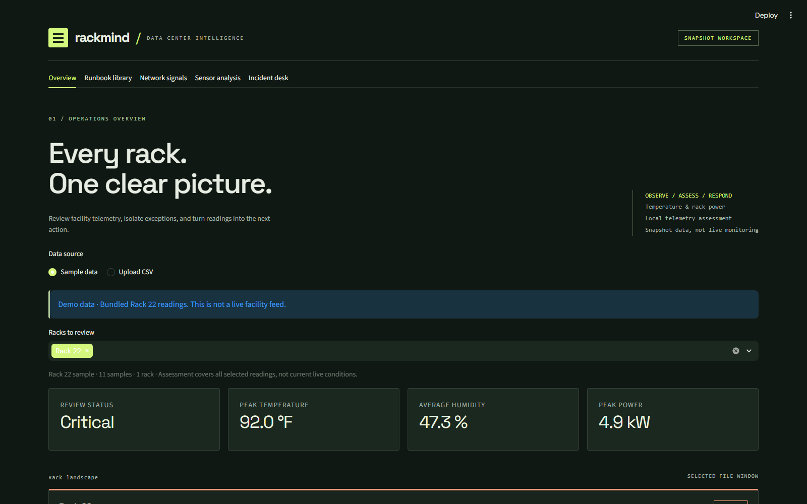
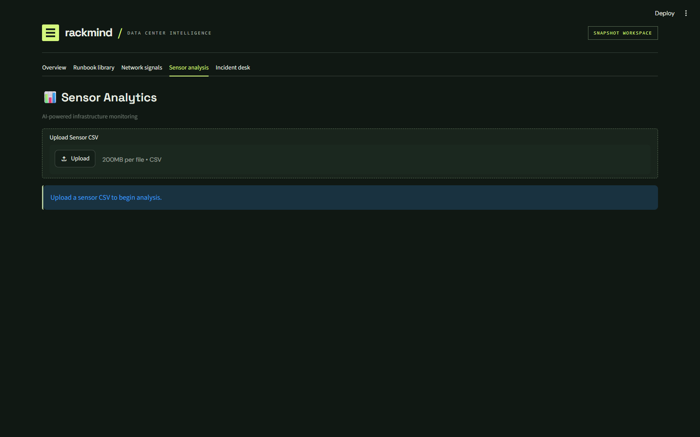

# RackMind AI

## Data Center Operations Copilot

RackMind AI is a Streamlit-based AI operations assistant for data center incident review. It analyzes switch logs, rack sensor telemetry, and runbook guidance, then uses either Google Gemini or OpenAI to produce a clear executive-style incident report.

This project is built around a real infrastructure workflow: CRC errors, interface resets, temperature events, rack power draw, runbook lookup, and escalation recommendations.

---

## What It Does

RackMind AI helps an operator answer questions like:

- Why are CRC errors increasing?
- Is the rack overheating?
- Are the logs and sensors pointing to the same problem?
- What runbook steps apply?
- What should be escalated first?
- How would this incident look in an executive report?

---

## Key Features

- Multi-page Streamlit dashboard
- Dashboard CSV uploads with rack filtering, prioritized temperature/power alerts, and downloadable JSON reviews
- Explicit sample/snapshot labels and missing-data warnings, with threshold lines on telemetry charts
- Gemini or OpenAI incident report generation
- Provider selection with `AI_PROVIDER=auto`, `gemini`, or `openai`
- Coordinator agent that routes work to specialized agents
- Log agent for switch warnings, errors, CRC events, resets, and temperatures
- Sensor agent for temperature, humidity, and power telemetry
- Runbook search workflow
- Defensive parsing so missing CSV fields do not crash the app
- Clear fallback messages when API keys are missing or mismatched

---

## Architecture

```text
User / Operator
      |
      v
Streamlit Dashboard
      |
      v
RackMind Coordinator Agent
      |
      +--> Log Agent
      |       - Parses switch and infrastructure logs
      |       - Detects warnings, errors, CRC events, resets, and heat events
      |
      +--> Sensor Agent
      |       - Reviews rack temperature, humidity, and power data
      |       - Flags environmental risk
      |
      +--> Runbook Agent
      |       - Searches operational documentation
      |       - Returns relevant response steps
      |
      +--> Report Agent
              - Combines logs, sensors, and runbooks
              - Uses Gemini or OpenAI to generate an executive report
```

---

## Tech Stack

- Python
- Streamlit
- Pandas
- Google Gemini
- OpenAI
- Google ADK
- RAG-style runbook retrieval
- GitHub

---

## Project Structure

```text
rackmind-ai/
  rackmind.py              # Main Streamlit entry point

  agents/
    coordinator.py         # Routes work between agents
    log_agent.py           # Log analysis agent
    sensor_agent.py        # Sensor analysis agent
    runbook_agent.py       # Runbook Q&A agent
    report_agent.py        # Incident report agent

  pages/
    dashboard.py           # Dashboard tab
    logs.py                # Log analysis tab
    sensors.py             # Sensor analytics tab
    runbook.py             # Runbook search tab
    incident.py            # Incident commander tab
    topology.py            # Topology view

  services/
    gemini_service.py      # Central AI provider service
    log_parser.py          # Log parser
    sensor_parser.py       # Sensor CSV parser
    vector_service.py      # Runbook search service
    incident_service.py    # Incident coordination service
    logger.py              # App logging

  data/                    # Sample logs, sensors, and runbooks
  .streamlit/              # Streamlit settings
```

---

## Setup

Clone the repository:

```bash
git clone https://github.com/Toddni8022/rackmind-ai.git
cd rackmind-ai
```

Create and activate a virtual environment:

```bash
python -m venv .venv
```

Windows PowerShell:

```bash
.\.venv\Scripts\Activate.ps1
```

macOS / Linux:

```bash
source .venv/bin/activate
```

Install dependencies:

```bash
pip install -r requirements.txt
```

Create a local `.env` file.

For automatic provider selection:

```text
AI_PROVIDER=auto
OPENAI_API_KEY=your_openai_key_here
OPENAI_MODEL=gpt-5.5
```

For Gemini only:

```text
AI_PROVIDER=gemini
GOOGLE_API_KEY=your_google_ai_studio_key_here
GEMINI_MODEL=gemini-2.5-flash
```

For OpenAI only:

```text
AI_PROVIDER=openai
OPENAI_API_KEY=your_openai_key_here
OPENAI_MODEL=gpt-5.5
```

Run the app:

```bash
streamlit run rackmind.py
```

---

## Streamlit Cloud Deployment

For Streamlit Community Cloud, use:

```text
Repository: Toddni8022/rackmind-ai
Branch: main
Main file path: rackmind.py
```

Add one of these secret blocks in Streamlit Cloud.

OpenAI:

```toml
AI_PROVIDER = "openai"
OPENAI_API_KEY = "your_openai_key_here"
OPENAI_MODEL = "gpt-5.5"
```

Gemini:

```toml
AI_PROVIDER = "gemini"
GOOGLE_API_KEY = "your_google_ai_studio_key_here"
GEMINI_MODEL = "gemini-2.5-flash"
```

Auto mode:

```toml
AI_PROVIDER = "auto"
OPENAI_API_KEY = "your_openai_key_here"
GOOGLE_API_KEY = "your_google_ai_studio_key_here"
OPENAI_MODEL = "gpt-5.5"
GEMINI_MODEL = "gemini-2.5-flash"
```

## App snapshots

These snapshots show RackMind AI using the bundled synthetic Rack 22 telemetry. They are safe to share and do not contain production facility data.





## Verification and Limitations

The deterministic parsers can be verified without sending infrastructure data to an AI provider:

```bash
pip install -r requirements-test.txt
python -m pytest -q
```

- AI root-cause summaries are hypotheses and must be checked against live device state.
- Thresholds and sample data demonstrate a workflow; they are not a substitute for facility alarm policy.
- The project does not connect directly to production switches, BMS, DCIM, paging, or ticketing systems.

In auto mode, RackMind uses OpenAI when `OPENAI_API_KEY` is present. If no OpenAI key is present, it falls back to Gemini when a Google key is present.

A valid Gemini key usually starts with `AIza`. A valid OpenAI key usually starts with `sk-`.

---

## Sensor CSV Format

### Dashboard telemetry review

In **Dashboard**, choose **Sample data** or **Upload CSV**, then select the racks to review. The dashboard assesses the entire selected file window, not current live conditions. Charts preserve each rack's file order; timestamps are shown as supplied and are not checked for freshness.

Temperature values are interpreted as Fahrenheit, humidity as percent, and power as kW. Use the column names and aliases below; a missing `rack` column groups readings under **Unspecified rack**. Use one column per metric. Ambiguous aliases and unsupported files show a validation error.

Missing/non-numeric/infinite readings, humidity outside 0–100%, and negative power are excluded from dashboard metrics and counted as data-quality gaps. An incomplete rack cannot receive a Normal status; valid critical/warning signals remain visible alongside gaps. Normal means only that the demo temperature and power thresholds were not exceeded with complete metric coverage. Humidity has no alarm policy in this view.

Dashboard thresholds come from `TEMP_WARNING`, `TEMP_CRITICAL`, and `POWER_WARNING` in `config.py`. They demonstrate a workflow and must be interpreted against facility policy. **Download review report** exports the selected racks, thresholds, alerts, and coverage as JSON. This dashboard review makes no AI provider calls; the existing AI tools are separate workflows.

The sensor page works best with columns like:

```csv
timestamp,rack,temperature,humidity,power_kw
2026-06-26 08:00,Rack-22,78,45,3.9
2026-06-26 08:05,Rack-22,84,47,4.2
2026-06-26 08:10,Rack-22,91,49,4.8
```

The parser also accepts common variations such as `temp`, `temp_f`, `rack_temperature`, `relative_humidity`, `power`, and `load_kw`.

---

## Example Incident Workflow

1. Upload switch log data.
2. Upload rack sensor CSV data.
3. RackMind parses logs and telemetry.
4. The runbook workflow retrieves relevant guidance.
5. Gemini or OpenAI generates an executive incident report with:
   - Executive summary
   - Root cause
   - Business impact
   - Recommended actions
   - Priority
   - Confidence level

---

## Roadmap

- PDF incident export
- Historical incident search
- Authentication
- Live infrastructure dashboard
- Multi-rack monitoring
- Trend analytics
- Demo video
- Architecture diagram
- Kaggle capstone polish

---

## Status

RackMind AI is an active AI agent capstone and portfolio project focused on practical data center operations.
